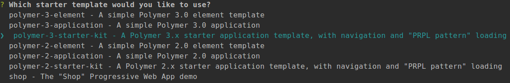

# Polymer 3
Polymer 3 is as it was Polymer 2 but HTML import is moved to ES6 modules. It uses NPM to install dependencies instead of ```bower```. 
It also included a tool [**modulizer**](https://github.com/Polymer/polymer-modulizer) to convert Polymer 2 to Polymer 3.

# How to install?

Install git
---
- Ubuntu: ```$ sudo apt-get install git```
- Windows: Follow the link - https://git-scm.com/download/win

Install NodeJS & NPM
---
**Ubuntu:**
- Step 1: ```$ curl -sL https://deb.nodesource.com/setup_10.x | sudo bash -```
- Step 2: ```$ sudo apt install nodejs```
- Step 3: Check NodeJS version: ```node -v``` and NPM version: ```npm -v

**Windows:**
- Download and install form the following link: https://nodejs.org/en/download/    

# Install Polymer CLI
 - Install: ```$ sudo npm install --unsafe-perm -g polymer-cli@next```
 - Check Polymer CLI version: ```polymer --version```
 
**Create project directory**
- Create directory **start-polymer-3**. ```[$ mkdir start-polymer-3]```
- Change directory. [```$ cd start-polymer-3```]

**Initialize Polymer 3 project**
- ```$ polymer init```
- Move down arrow key, select `polymer-3-starter-kin` and press `Enter` key
- Example:


# Run Polymer 3 app
- Run the command: ```$ npm start```
- Hit the following link on browser: [**http://127.0.0.1:8000**](http://127.0.0.1:8000)